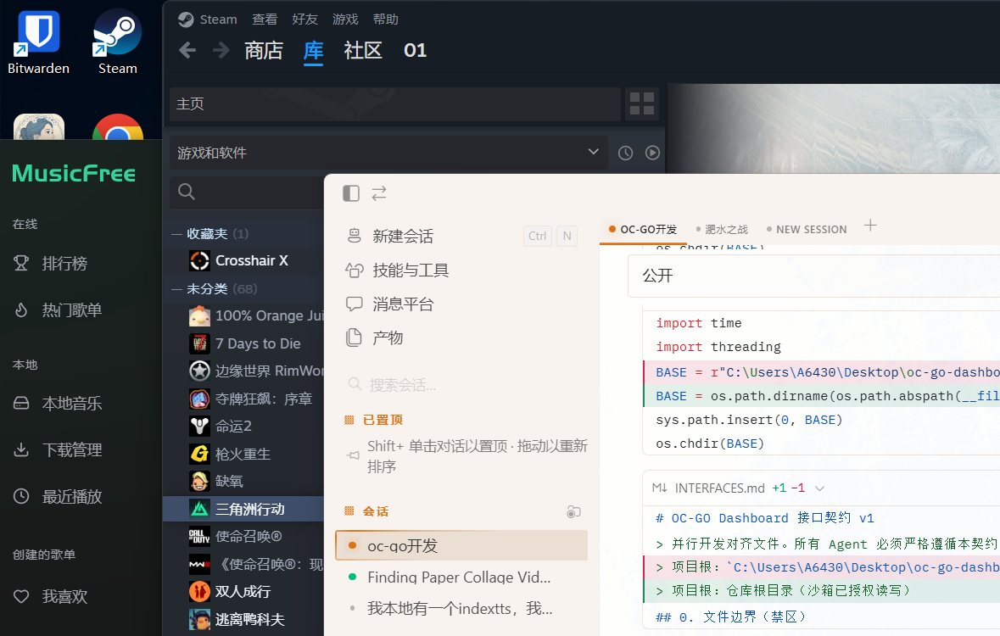
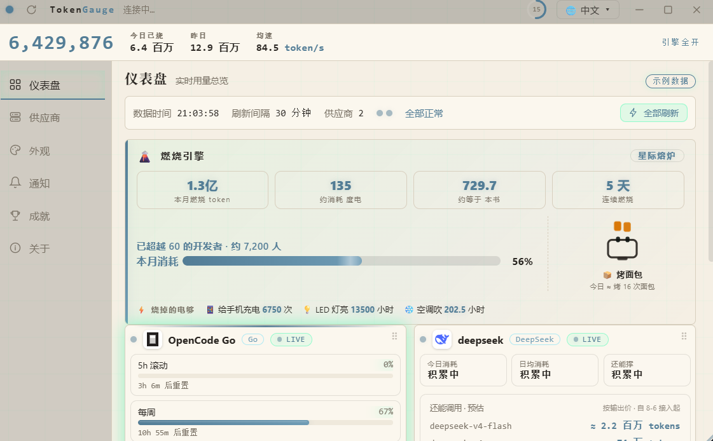
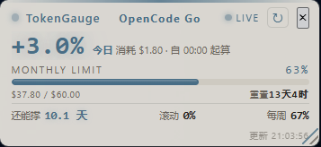
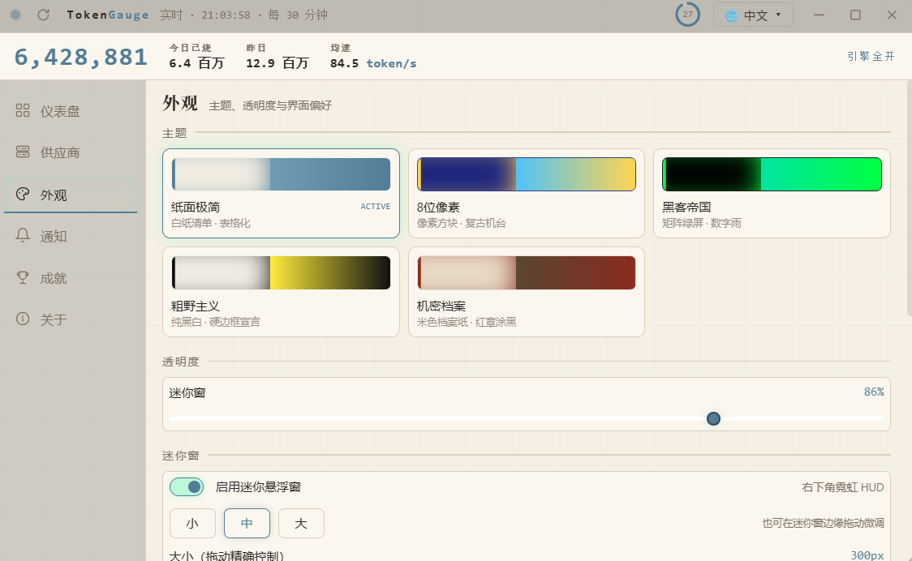
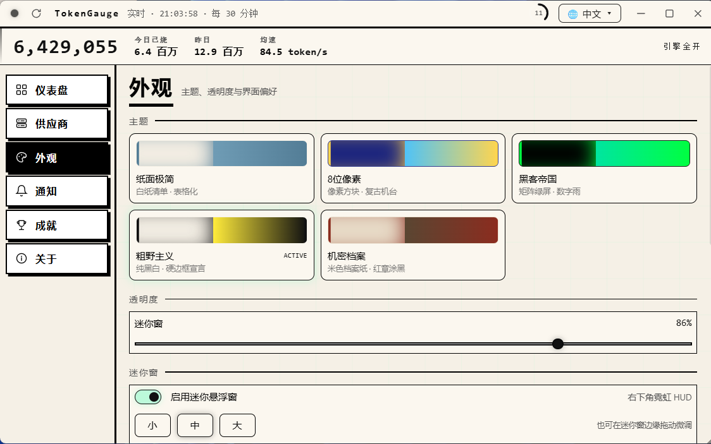
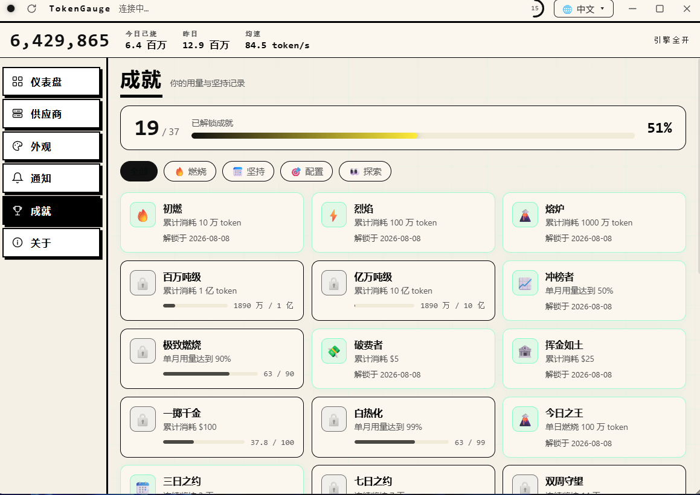
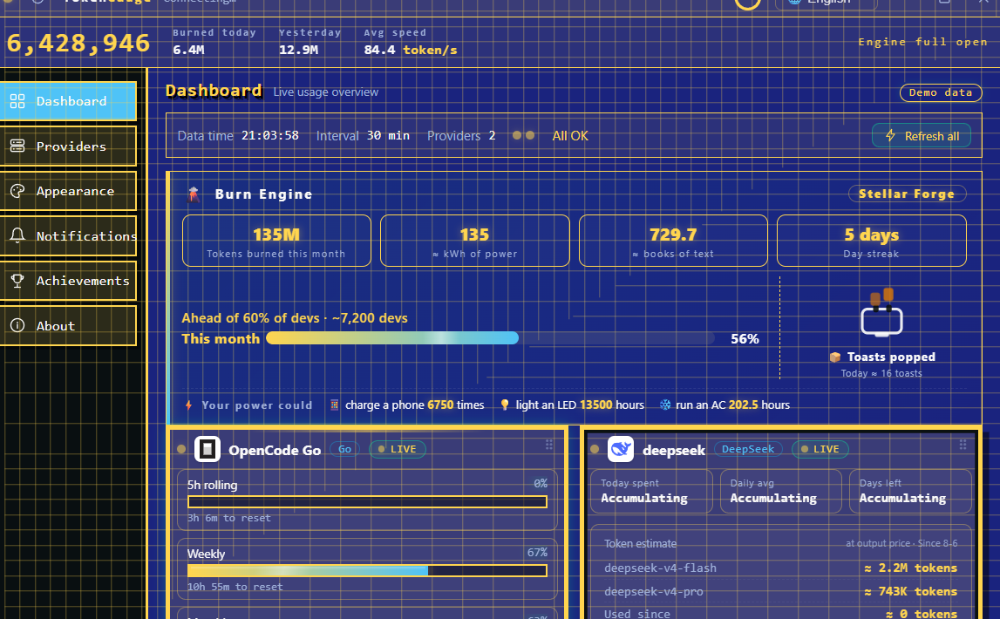

# TokenGauge — LLM Token Gauge

> **Monitor your LLM quota at a glance** — how many tokens are left, how long you can keep burning, across multiple providers.

**Chinese version: [README.zh.md](README.zh.md)**

---

## Download

**Windows standalone build (no Python needed)**: [Download TokenGauge.exe](https://github.com/643048695/token-gauge/releases) (GitHub Releases, run as-is)

Run from source: see [Installation](#installation).

---

## Screenshots

**Main dashboard · Matrix theme** (dark neon):



**Main dashboard · Paper theme** (default):



**Mini floating HUD widget** (bottom-right, draggable & resizable):



**Appearance · 5 themes** (Paper / 8-bit / Matrix / Brutalism / Classified):



**Brutalism theme** (pure black & white):



**Achievements** (37 achievements · burn / streak / setup / explore):



**8-bit theme · English UI** (fully bilingual, switchable in-app):



## Features

- **Multi-provider dashboard**: quota-based (OpenCode Go) and balance-based (DeepSeek / Kimi / SiliconFlow, etc.) providers on one screen; `app/providers/` is pluggable — add a provider by writing one file
- **Scheduled fetching** (default 30 min, configurable 60–1800s), retry on failure, STALE marking, single-instance lock
- **Quota progress bars** with reset countdowns (5h rolling / weekly / monthly)
- **3-layer burn-rate forecast** (linear regression / daily average / short-term) with confidence source ("days left")
- **Threshold notifications**: 80% warn / 95% urgent / cookie expiry / repeated failures; tray / system / off
- **5 themes** + custom accent color and transparency (main panel & mini widget independently)
- **Real-world equivalences**: today's burn ≈ kWh / books / phone charges / LED hours
- **Gamification**: 37 achievements (confetti on unlock) + dev percentile benchmark ("ahead of X% of developers")
- **Mini HUD widget** (bottom-right, resizable, draggable, transparent)
- **Bilingual UI** (Chinese/English, fully translated incl. charts, notifications, tray)
- **Accessibility**: respects `prefers-reduced-motion`

## Agent Integration

This project has been developed **by AI agents from day one** (Hermes / HanaAgent co-development), so it is agent-friendly:

| Integration | Description |
|---|---|
| **HanaAgent plugin** | `hana-plugin/` spawns the mini widget on Hana startup and reaps it on exit |
| **CLI** | `cli.py add / set / rm / list / test` — agents can manage providers from the terminal |
| **Interface contract** | `INTERFACES.md` defines file boundaries & data contracts for parallel agent development |
| **js_api bridge** | 15+ methods exposed via `window.pywebview.api` (get_view / save_settings / refresh_now / …) |
| **Data snapshots** | 30-day JSON snapshots per provider in `app/data/snapshots/` — readable offline by agents |
| **Single-file frontend** | `ui/main_panel.html` is fully inlined (HTML/CSS/JS) — zero build, zero deps |
| **Zero-config start** | `python main.py`; onboarding wizard when no credentials exist |

## How It Works

1. **Fetch**: parallel per-provider fetching on `refresh_interval_sec` (quota types read official pages; API types call official APIs)
2. **Snapshot**: every successful fetch → `app/data/snapshots/<provider>.json` (30-day retention)
3. **Forecast**: 3-layer estimation from snapshots → "days left" with confidence
4. **Render**: main panel / mini widget / notifications; credentials DPAPI-encrypted (machine-bound)

## Installation

```bash
# Windows · Python 3.11+
git clone https://github.com/643048695/token-gauge.git
cd token-gauge
pip install -r requirements.txt
```

Copy `config.example.json` to `config.json` and fill in provider credentials (or use the UI's Providers page — saved instantly).

## Running

```bash
python main.py
```

Double-click the tray icon (green dot) to toggle the main panel; closing the panel hides to tray. Mini widget lives bottom-right; toggle/size/opacity in Appearance.

## Configuration (config.json)

| Field | Description |
|---|---|
| `providers.<id>.config` | per-provider credentials (opencode-go: workspace_id + auth_cookie; api types: api_key + base_url) |
| `refresh_interval_sec` | fetch interval (default 300, 60–1800) |
| `theme` / `opacity` / `notify` / `window` | theme, transparency, notifications, window geometry |
| `display` | unit mode (auto/usd/cny/tokens), fx rate |
| `diy.modules` | per-card module toggles (meta_grid / token_est / chart / …) |

## Testing

```bash
python -m unittest test_achievements test_unit   # 36 unit tests
python test_integration.py                        # 21 integration assertions
```

CI runs on every push (windows-latest).

## Architecture

```
main.py              entry: tray + windows + js_api (pywebview)
app/kernel.py        scheduler: parallel fetch, cache, stale marking
app/settings.py      config read/write (deep-merge defaults, dot paths)
app/notifier.py      notifications (tray/system/off + dedup)
app/themes.py        5 themes + build_css
app/achievements.py  37 achievements
app/providers/       provider plugins (base.py + opencode_go.py / api_provider.py)
app/store.py         per-provider snapshots (30 days)
ui/main_panel.html   main panel (single inlined file)
ui/mini_widget.html  mini widget
ui/index.html        onboarding wizard
cli.py               CLI for agents
```

## Notes

- Read-only access to opencode.ai; no third-party uploads
- `auth_cookie` is your account key — never share it
- Credentials live only in local `config.json` (gitignored)

## Disclaimer

- **Unofficial**: not affiliated with OpenCode, DeepSeek or any vendor; brand names & icons belong to their owners
- **For learning**: the opencode-go adapter reads public pages read-only; comply with third-party ToS; use at your own risk
- MIT licensed, no warranty

## License

[MIT](LICENSE)
